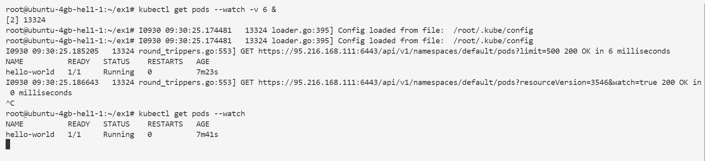
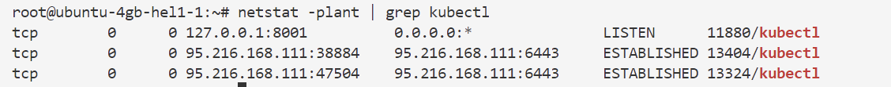
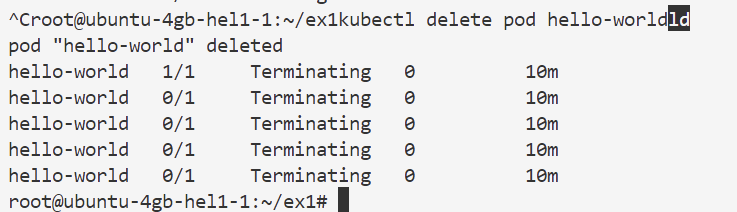
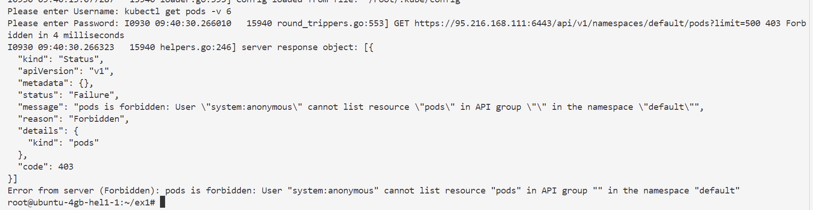
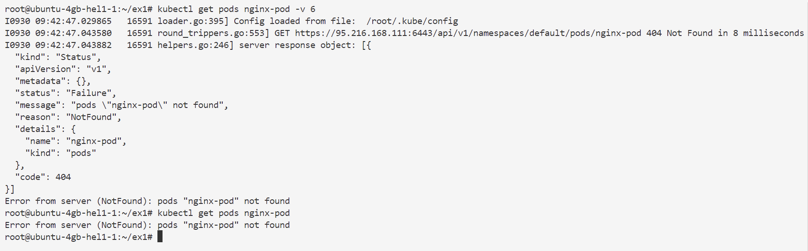
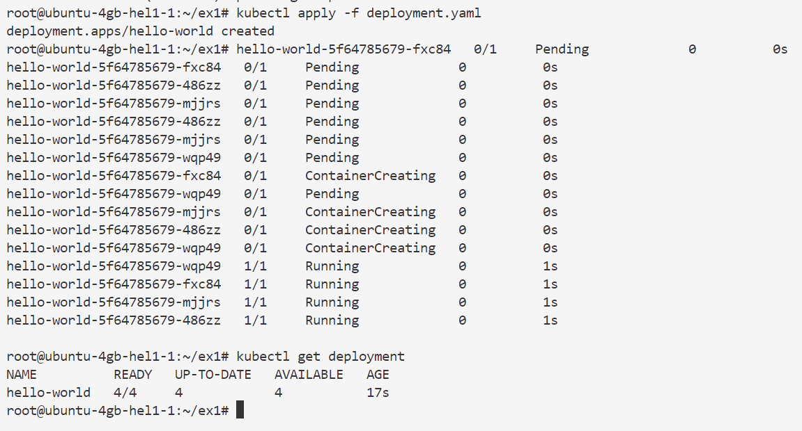

```markdown
# 🧪 Exercice – Anatomie d’une requête API Kubernetes avec `kubectl`
⏱️ **Durée estimée : 40 minutes**

## 🎯 Objectifs
- Comprendre comment `kubectl` communique avec l’API Server.
- Explorer les niveaux de verbosité (`-v 6` à `-v 9`) pour voir les détails des requêtes.
- Manipuler les Pods via `kubectl proxy`, `watch`, et `logs`.
- Observer et comprendre les codes HTTP (200, 403, 404).

## Introduction
Cet exercice vous guidera à travers les différentes façons d'interagir avec l'API Kubernetes en utilisant `kubectl`. Vous apprendrez à créer et interroger des Pods, à utiliser différents niveaux de verbosité pour voir les détails des requêtes, à utiliser `kubectl proxy` pour accéder directement à l'API, et à comprendre les codes HTTP retournés par l'API.

---

## 1️⃣ Créer et interroger un Pod

### a) Créer un Pod à partir d’un manifest
```bash
kubectl apply -f pod.yaml
```
Cette commande crée un Pod en utilisant le fichier de manifest `pod.yaml`.

### b) Vérifier que le Pod tourne
```bash
kubectl get pod hello-world
```
Cette commande vérifie que le Pod `hello-world` est en cours d'exécution.

---

## 2️⃣ Utiliser la verbosité de `kubectl`
La commande `kubectl -v <niveau>` permet de voir les détails des requêtes envoyées à l’API.

### a) Niveau 6 – requête et réponse
```bash
kubectl get pod hello-world -v 6
```
👉 Observe : **VERB**, **chemin API**, **code de réponse** (200).
Ce niveau de verbosité montre les détails de la requête et de la réponse, y compris le verbe HTTP utilisé, le chemin de l'API, et le code de réponse.

### b) Niveau 7 – ajout des entêtes HTTP
```bash
kubectl get pod hello-world -v 7
```
👉 Observe : **Content-Type**, **User-Agent**.
Ce niveau ajoute les entêtes HTTP à la sortie, ce qui est utile pour comprendre les détails de la requête.

### c) Niveau 8 – corps de réponse tronqué
```bash
kubectl get pod hello-world -v 8
```
Ce niveau montre le corps de la réponse, mais de manière tronquée.

### d) Niveau 9 – réponse complète
```bash
kubectl get pod hello-world -v 9
```
👉 Focus sur la **métadonnée `metadata`** en bas.
Ce niveau montre la réponse complète de l'API, y compris toutes les métadonnées.

---

## 3️⃣ Utiliser `kubectl proxy` et `curl`

### a) Lancer un proxy
```bash
kubectl proxy &
```
Cette commande lance un proxy local qui permet d'accéder directement à l'API Kubernetes.

### b) Interroger directement l’API
```bash
curl http://localhost:8001/api/v1/namespaces/default/pods/hello-world | head -n 10
```
Cette commande utilise `curl` pour interroger directement l'API via le proxy.

### c) Fermer le proxy
```bash
ctrl+c
```
Ces commandes ferment le proxy.

---

## 4️⃣ Watch, Exec et Logs

### a) Observer en continu les Pods
```bash
kubectl get pods --watch -v 6 &
```

👉 La connexion TCP reste ouverte.
Cette commande observe en continu les Pods et montre les mises à jour en temps réel.

### b) Vérifier la connexion
```bash
netstat -plant | grep kubectl
```

Cette commande vérifie que la connexion TCP est bien établie.

### c) Supprimer le Pod → mise à jour immédiate
```bash
kubectl delete pod hello-world
```

Cette commande supprime le Pod `hello-world` et vous devriez voir une mise à jour immédiate dans la sortie de la commande `watch`.

### d) Recréer le Pod
```bash
kubectl apply -f pod.yaml
```
Cette commande recrée le Pod `hello-world`.

### e) Arrêter le watch
```bash
ctrl+c
```
Ces commandes arrêtent la commande `watch`.

---

## 5️⃣ Accéder aux logs

### a) Par `kubectl`
```bash
kubectl logs hello-world
kubectl logs hello-world -v 6
```
Ces commandes affichent les logs du Pod `hello-world`.

### b) Via `kubectl proxy` + `curl`
```bash
kubectl proxy &
curl http://localhost:8001/api/v1/namespaces/default/pods/hello-world/log

ctrl+c
```
Ces commandes utilisent le proxy pour accéder aux logs du Pod via `curl`.

---

## 6️⃣ Démonstration d’échec d’authentification

### a) Sauvegarder la config
```bash
cp ~/.kube/config ~/.kube/config.ORIG
```
Cette commande sauvegarde la configuration actuelle de `kubectl`.

### b) Modifier l’utilisateur
Editer le fichier ~/.kube/config et change la ligne `user: kubernetes-admin` → `user: kubernetes-admin1`.
Modifiez le fichier de configuration pour utiliser un utilisateur non autorisé.

### c) Relancer une commande
```bash
kubectl get pods 
```

👉 Résultat attendu : **403 Forbidden**.
Cette commande devrait échouer avec un code 403 car l'utilisateur n'est pas autorisé.

### d) Restaurer la config
```bash
cp ~/.kube/config.ORIG ~/.kube/config
kubectl get pods
```
Ces commandes restaurent la configuration originale et vérifient que tout fonctionne à nouveau.

---

## 7️⃣ Tester les erreurs 404 et la création d’objets

### a) Ressource inexistante
```bash
kubectl get pods nginx-pod -v 6
```

👉 Résultat attendu : **404 Not Found**.
Cette commande essaie d'accéder à un Pod inexistant et devrait retourner un code 404.

### b) Créer un Deployment
```bash
kubectl apply -f deployment.yaml 
kubectl get deployment
```

👉 Observe : **POST → 201 Created**.
Ces commandes créent un Deployment et montrent que la requête POST retourne un code 201.

### c) Supprimer les objets
```bash
kubectl delete deployment hello-world -v 6
kubectl delete pod hello-world
```
👉 Observe : **DELETE → 200 OK**.
Ces commandes suppriment le Deployment et le Pod, et montrent que la requête DELETE retourne un code 200.

---

## ✅ Résultats attendus
- Comprendre les échanges HTTP entre `kubectl` et l’API Server.
- Voir en pratique les réponses **200**, **403**, **404**.
- Utiliser `kubectl proxy` pour accéder directement à l’API.
- Savoir suivre les événements avec `--watch`.

```