```markdown
# 🧪 Exercice – Labels, Sélecteurs et Planification avec `kubectl`
⏱️ **Durée estimée : 50 minutes**

## 🎯 Objectifs
- Créer et gérer des Pods avec des labels.
- Utiliser des sélecteurs pour filtrer les ressources.
- Comprendre l’utilisation des labels dans les Deployments, ReplicaSets et Services.
- Influencer la planification des Pods avec `nodeSelector` et des labels de nœuds.

## Introduction
Dans cet exercice, vous allez apprendre à utiliser les labels et les sélecteurs pour gérer et organiser vos ressources Kubernetes. Vous verrez comment les labels peuvent être utilisés pour filtrer les ressources, comment les contrôleurs comme les Deployments et ReplicaSets utilisent les labels pour gérer les Pods, et comment influencer la planification des Pods en utilisant des labels de nœuds.

---

## 1️⃣ Manipuler les labels sur les Pods

### a) Créer des Pods avec labels
```bash
kubectl apply -f CreatePodsWithLabels.yaml
```
Cette commande crée des Pods avec des labels définis dans le fichier `CreatePodsWithLabels.yaml`.

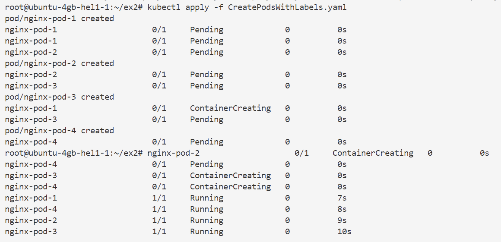

### b) Lister les labels
```bash
kubectl get pods --show-labels
kubectl describe pod nginx-pod-1 | head
```
Ces commandes listent les Pods avec leurs labels et affichent les détails d'un Pod spécifique.

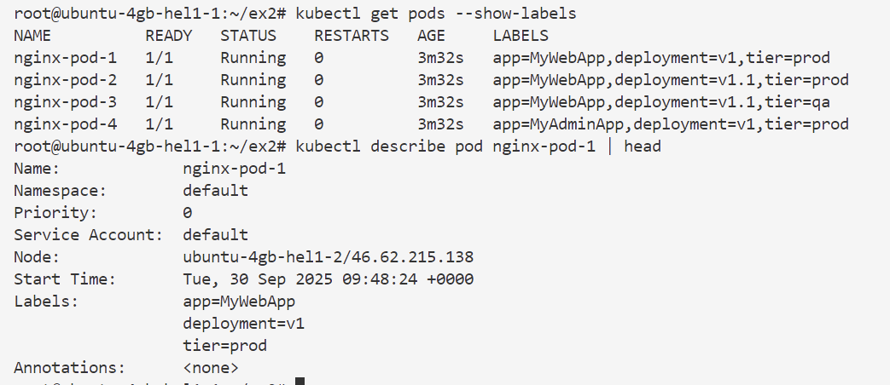

### c) Utiliser des sélecteurs
```bash
kubectl get pods -l tier=prod
kubectl get pods -l tier=qa
kubectl get pods -l tier=prod --show-labels
kubectl get pods -l 'tier=prod,app=MyWebApp' --show-labels
kubectl get pods -l 'tier notin (prod,qa)'
```
Ces commandes utilisent des sélecteurs pour filtrer les Pods en fonction de leurs labels.

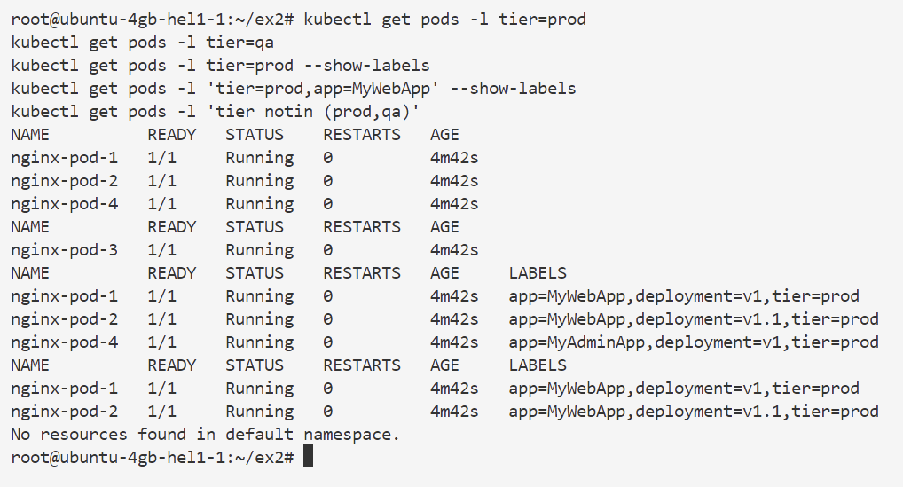

### d) Afficher les labels sous forme de colonnes
```bash
kubectl get pods -L tier
kubectl get pods -L tier,app
```
Ces commandes affichent les labels sous forme de colonnes pour une meilleure visibilité.

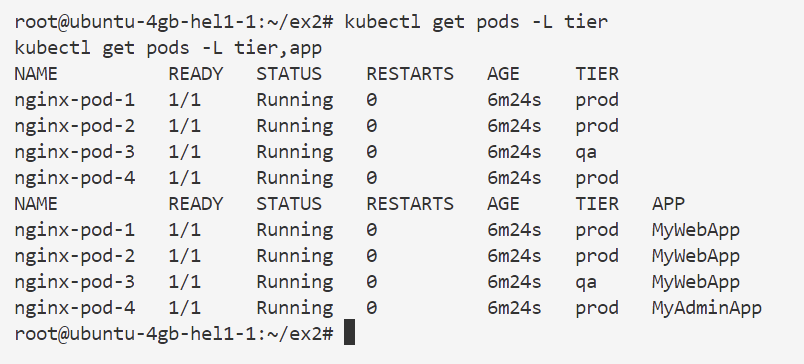

### e) Modifier les labels
```bash
kubectl label pod nginx-pod-1 tier=non-prod --overwrite
kubectl label pod nginx-pod-1 another=Label
kubectl label pod nginx-pod-1 another-
kubectl get pod nginx-pod-1 --show-labels
```
Ces commandes modifient les labels d'un Pod, ajoutent un nouveau label et suppriment un label.

### f) Opérer sur plusieurs Pods
```bash
kubectl label pod --all tier=non-prod --overwrite
kubectl delete pod -l tier=non-prod
kubectl get pods --show-labels   # → plus aucun pod
```
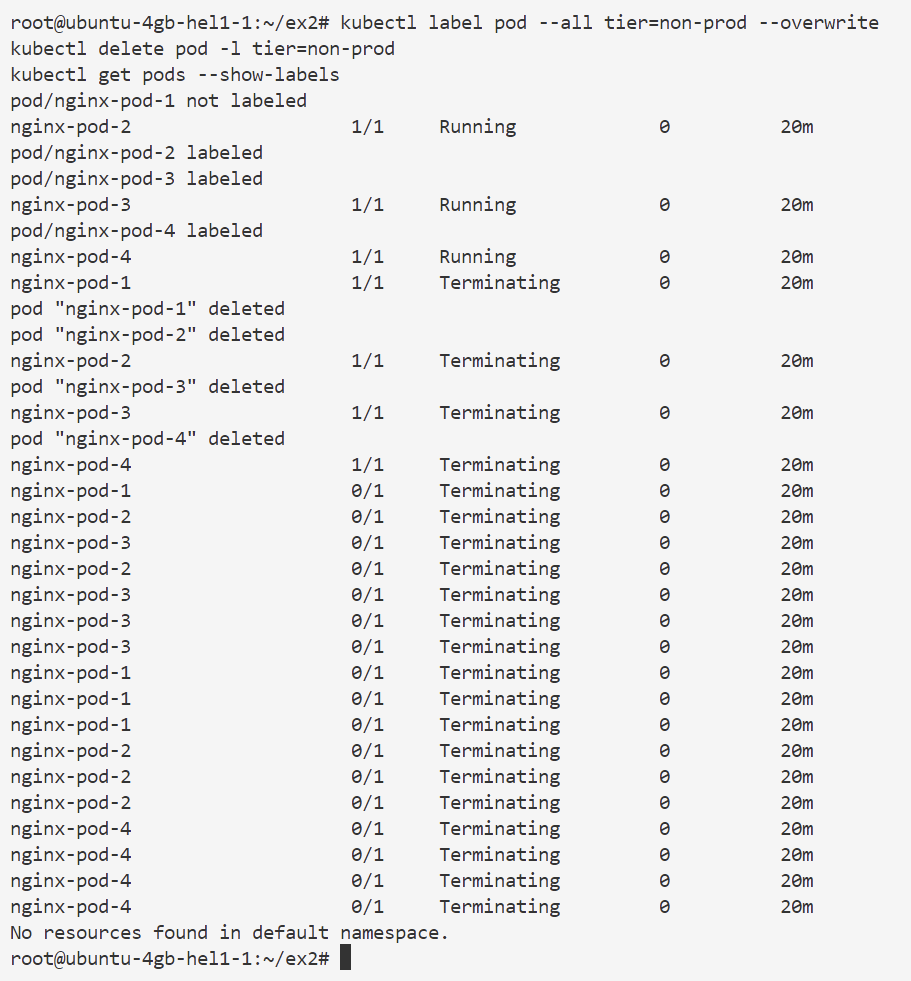
Ces commandes modifient les labels de tous les Pods et suppriment les Pods avec un label spécifique.

---

## 2️⃣ Labels et contrôleurs (Deployments, ReplicaSets, Services)

### a) Déployer une application
```bash
kubectl apply -f deployment-label.yaml
kubectl apply -f service.yaml
```
Ces commandes déploient une application en utilisant un Deployment et un Service.

### b) Explorer les sélecteurs
* **Deployment** :
```bash
kubectl describe deployment hello-world
```
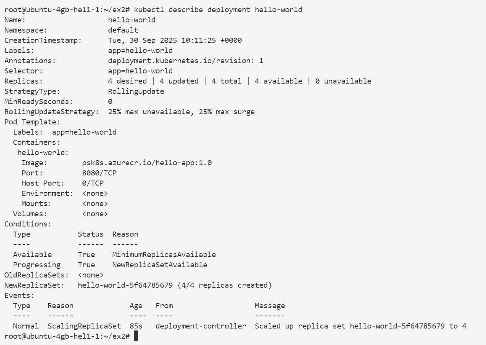
👉 Sélecteur : `app=hello-world`.
Cette commande montre comment le Deployment utilise les labels pour gérer les Pods.

* **ReplicaSet** :
```bash
kubectl describe replicaset hello-world
```
👉 Ajoute un label `pod-template-hash`.
Cette commande montre comment le ReplicaSet utilise les labels pour gérer les Pods.

* **Pods** :
```bash
kubectl get pods --show-labels
```
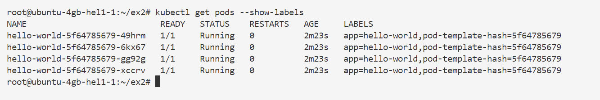
Cette commande liste les Pods avec leurs labels.

### c) Modifier un label de Pod
```bash
kubectl label pod PASTE_POD_NAME_HERE pod-template-hash=DEBUG --overwrite
kubectl get pods --show-labels
```
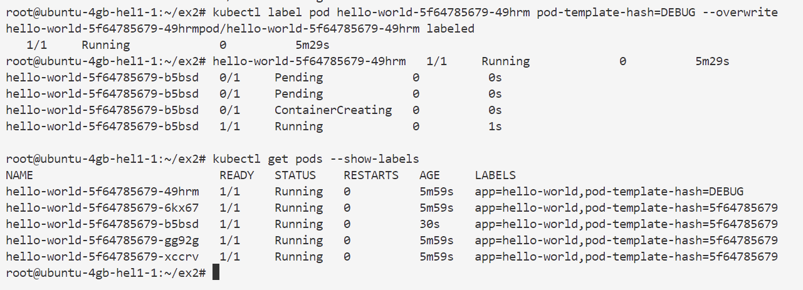

👉 Le ReplicaSet recrée un Pod pour maintenir le nombre de replicas.
Ces commandes modifient un label de Pod et montrent comment le ReplicaSet réagit.

### d) Étudier le Service
```bash
kubectl get service
kubectl describe service hello-world
kubectl describe endpoints hello-world
kubectl get pods -o wide
```
👉 Le Service envoie le trafic vers tous les Pods correspondant à `app=hello-world`.
Ces commandes montrent comment le Service utilise les labels pour diriger le trafic.

### e) Exclure un Pod du Service
```bash
kubectl label pod PASTE_POD_NAME_HERE app=DEBUG --overwrite
kubectl get pods --show-labels
kubectl describe endpoints hello-world   # → 1 Pod en moins
```
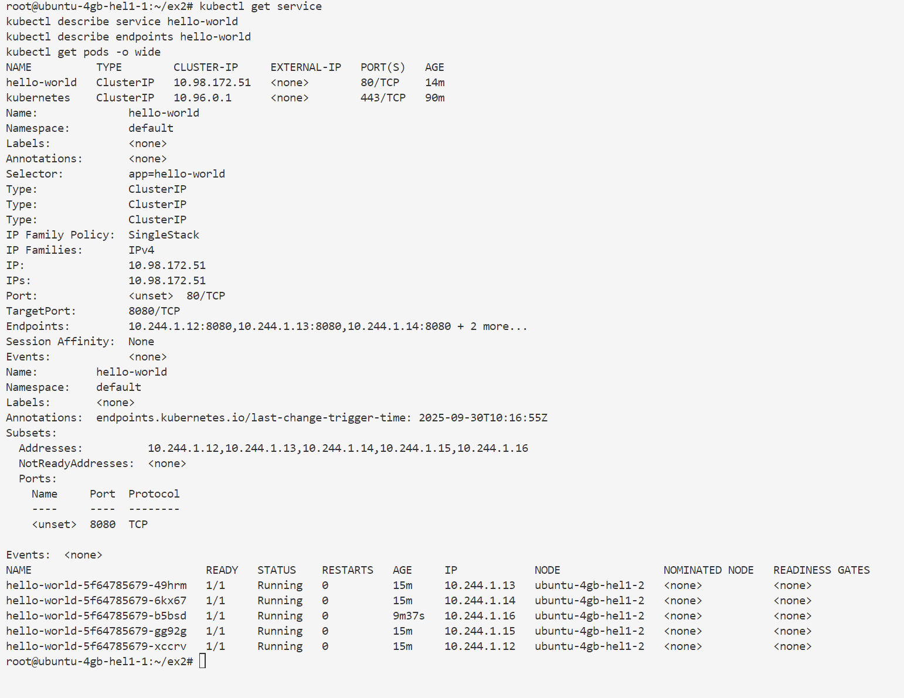
Ces commandes modifient un label de Pod pour l'exclure du Service.

### f) Nettoyer
```bash
kubectl delete deployment hello-world
kubectl delete service hello-world
kubectl delete pod PASTE_POD_NAME_HERE
```
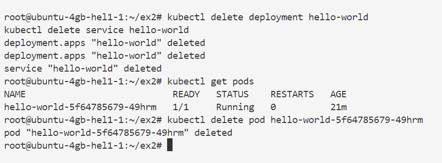
Ces commandes nettoient les ressources créées.

---

## 3️⃣ Labels et scheduling de Pods

### a) Lister les labels des nœuds
```bash
kubectl get nodes --show-labels
```

Cette commande liste les nœuds avec leurs labels.

### b) Ajouter des labels aux nœuds
```bash
kubectl label node c1-node2 disk=local_ssd
kubectl label node c1-node3 hardware=local_gpu
kubectl get node -L disk,hardware
```
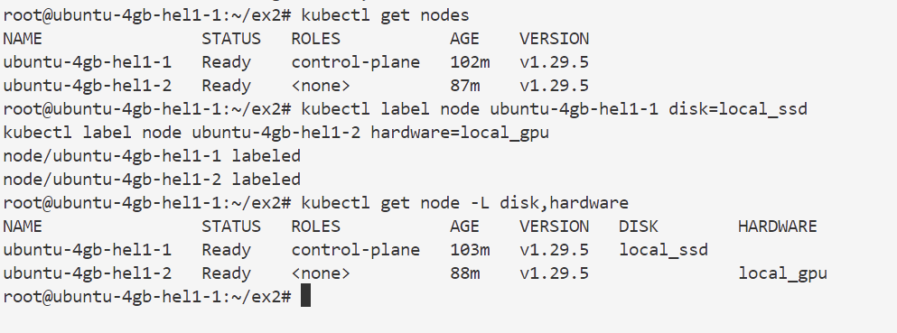
Ces commandes ajoutent des labels aux nœuds pour influencer la planification des Pods.

### c) Créer des Pods avec `nodeSelector`
```bash
kubectl apply -f PodsToNodes.yaml
kubectl get pods -o wide
```
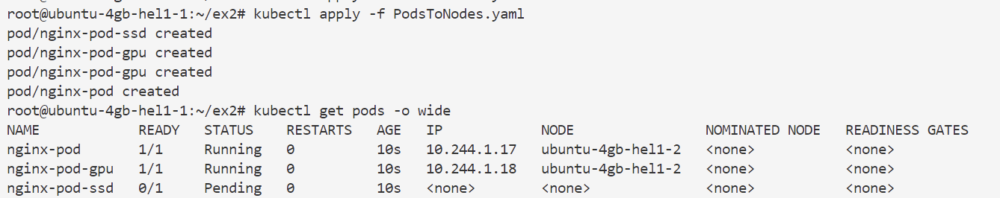
👉 Observer sur quels nœuds ils sont placés.
Ces commandes créent des Pods avec des `nodeSelector` pour influencer leur placement.

### d) Nettoyer
```bash
kubectl label node c1-node2 disk-
kubectl label node c1-node3 hardware-
kubectl delete pod nginx-pod
kubectl delete pod nginx-pod-gpu
kubectl delete pod nginx-pod-ssd
```
Ces commandes nettoient les labels des nœuds et suppriment les Pods créés.

---

## ✅ Résultats attendus
- Comprendre comment **attribuer, modifier, supprimer et filtrer des labels**.
- Savoir comment les **Deployments/ReplicaSets/Services** utilisent les labels et sélecteurs.
- Observer que les **Services ne load balancent que les Pods correspondant aux sélecteurs**.
- Utiliser des **labels de nœuds** pour influencer la planification des Pods via `nodeSelector`.

```