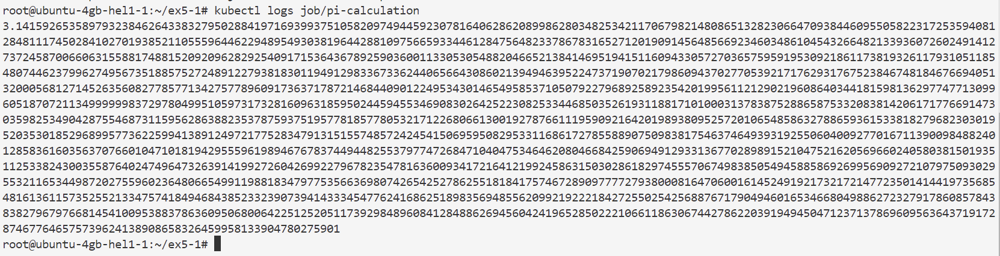
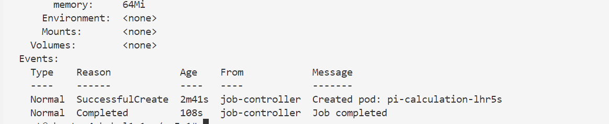
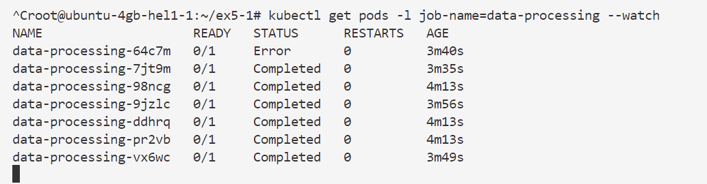
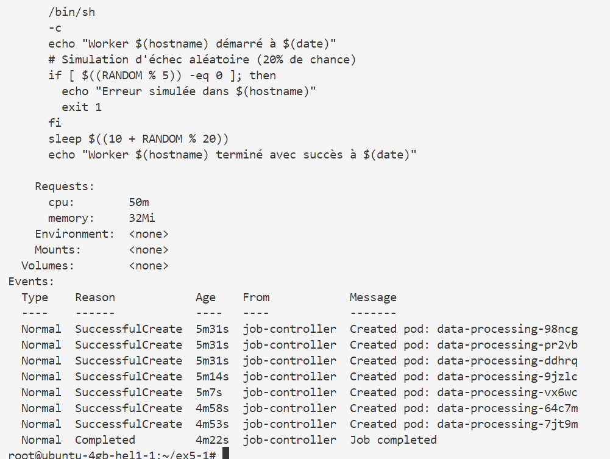
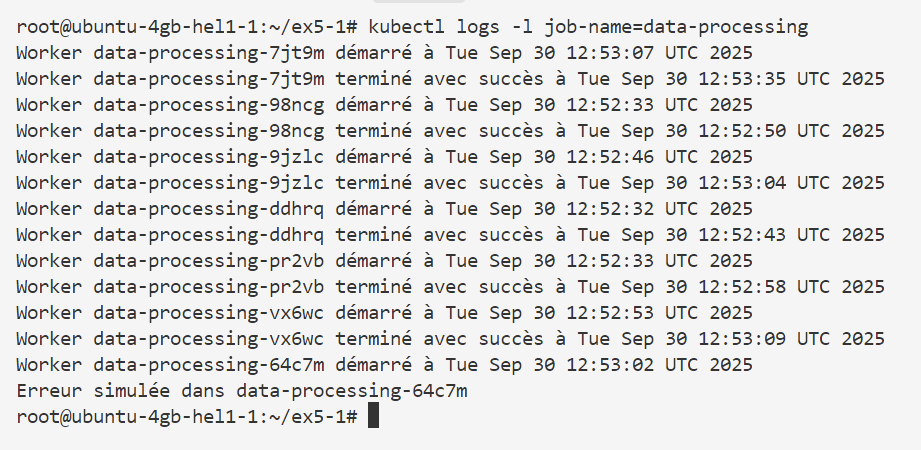
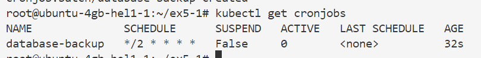
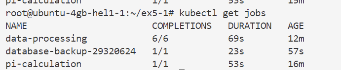
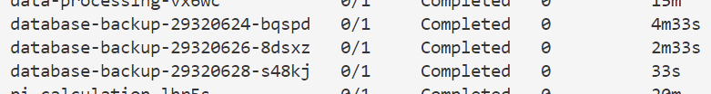
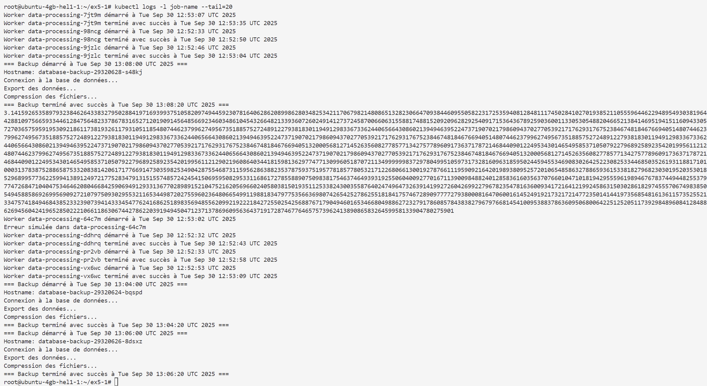

```markdown
# 🧪 Exercice - Gestion des Jobs et CronJobs dans Kubernetes
⏱️ **Durée estimée : 20-25 minutes**

## 🎯 Objectifs
- Comprendre comment créer et gérer des tâches ponctuelles (Jobs) et planifiées (CronJobs)
- Apprendre à configurer la gestion des échecs et des parallélismes
- Savoir surveiller et analyser l'exécution des Jobs et CronJobs

## Introduction
Ce TP vous guidera à travers la création et la gestion de Jobs et CronJobs dans Kubernetes. Vous apprendrez à configurer des tâches ponctuelles, des tâches parallèles et des tâches planifiées, ainsi qu'à gérer les échecs et à surveiller leur exécution.

---

## 1. Job simple (5 min)

### Description
Création d'un Job simple qui calcule le nombre π avec une limite de ressources et une politique de redémarrage.

### Fichier `simple-job.yaml`
```yaml
apiVersion: batch/v1
kind: Job
metadata:
  name: pi-calculation
spec:
  # Nombre maximum de tentatives en cas d'échec
  backoffLimit: 3
  # Durée maximale d'exécution (en secondes)
  activeDeadlineSeconds: 300
  template:
    spec:
      containers:
      - name: pi
        image: perl:5.34
        command: ["perl", "-Mbignum=bpi", "-wle", "print bpi(2000)"]
        resources:
          requests:
            memory: "64Mi"
            cpu: "100m"
          limits:
            memory: "128Mi"
            cpu: "200m"
      # Politique de redémarrage (Never = pas de redémarrage automatique)
      restartPolicy: Never
```

### Commandes
```bash
# Créer le Job à partir du fichier YAML
kubectl apply -f simple-job.yaml

# Vérifier l'état du Job
kubectl get jobs

# Voir les logs du Job
kubectl logs job/pi-calculation

# Obtenir des détails sur le Job
kubectl describe job pi-calculation

```

---

## 2. Job parallèle avec gestion d'échecs (7 min)

### Description
Création d'un Job parallèle avec simulation d'échecs aléatoires pour démontrer la gestion des échecs.

### Fichier `parallel-job.yaml`
```yaml
apiVersion: batch/v1
kind: Job
metadata:
  name: data-processing
spec:
  # Nombre de pods à exécuter en parallèle
  parallelism: 3
  # Nombre total de complétions nécessaires
  completions: 6
  # Nombre maximum de tentatives en cas d'échec
  backoffLimit: 2
  # Durée maximale d'exécution (en secondes)
  activeDeadlineSeconds: 180
  template:
    spec:
      containers:
      - name: worker
        image: busybox:1.35
        command:
        - /bin/sh
        - -c
        - |
          echo "Worker $(hostname) démarré à $(date)"
          # Simulation d'échec aléatoire (20% de chance)
          if [ $((RANDOM % 5)) -eq 0 ]; then
            echo "Erreur simulée dans $(hostname)"
            exit 1
          fi
          sleep $((10 + RANDOM % 20))
          echo "Worker $(hostname) terminé avec succès à $(date)"
        resources:
          requests:
            memory: "32Mi"
            cpu: "50m"
      restartPolicy: Never
```

### Commandes
```bash
# Créer le Job parallèle
kubectl apply -f parallel-job.yaml

# Vérifier l'état du Job
kubectl get jobs

# Surveiller l'exécution des pods (avec mise à jour automatique)
kubectl get pods -l job-name=data-processing --watch


# Obtenir des détails sur le Job
kubectl describe job data-processing


# Voir les logs de tous les pods du Job
kubectl logs -l job-name=data-processing

```

---

## 3. CronJob avec nettoyage automatique (8 min)

### Description
Création d'un CronJob qui simule une sauvegarde de base de données toutes les 2 minutes, avec gestion des échecs et politique de concomitance.

### Fichier `backup-cronjob.yaml`
```yaml
apiVersion: batch/v1
kind: CronJob
metadata:
  name: database-backup
spec:
  # Planification (toutes les 2 minutes)
  schedule: "*/2 * * * *"
  jobTemplate:
    spec:
      backoffLimit: 1
      activeDeadlineSeconds: 120
      template:
        spec:
          containers:
          - name: backup
            image: busybox:1.35
            command:
            - /bin/sh
            - -c
            - |
              echo "=== Backup démarré à $(date) ==="
              echo "Hostname: $(hostname)"
              echo "Connexion à la base de données..."
              sleep 5
              echo "Export des données..."
              sleep 10
              echo "Compression des fichiers..."
              sleep 5
              # Simulation d'échec aléatoire (10% de chance)
              if [ $((RANDOM % 10)) -eq 0 ]; then
                echo "ERREUR: Échec de la sauvegarde !"
                exit 1
              fi
              echo "=== Backup terminé avec succès à $(date) ==="
            resources:
              requests:
                memory: "32Mi"
                cpu: "50m"
          # Politique de redémarrage en cas d'échec
          restartPolicy: OnFailure
  # Nombre de Jobs réussis à conserver
  successfulJobsHistoryLimit: 3
  # Nombre de Jobs échoués à conserver
  failedJobsHistoryLimit: 1
  # Politique de concomitance (Forbid = pas de chevauchement)
  concurrencyPolicy: Forbid
```

### Commandes
```bash
# Créer le CronJob
kubectl apply -f backup-cronjob.yaml

# Vérifier l'état du CronJob
kubectl get cronjobs


# Obtenir des détails sur le CronJob
kubectl describe cronjob database-backup

# Lister les Jobs créés par le CronJob
kubectl get jobs


# Lister les pods associés aux Jobs
kubectl get pods -l job-name


# Voir les logs des pods (20 dernières lignes)
kubectl logs -l job-name --tail=20


# Créer manuellement un Job à partir du CronJob
kubectl create job manual-backup --from=cronjob/database-backup

# Voir les logs du Job manuel
kubectl logs job/manual-backup

# Vérifier à nouveau les Jobs
kubectl get jobs
```

---

## ✅ Validation finale
Pour valider que tout fonctionne correctement :
```bash
# Vérifier l'état de tous les Jobs et CronJobs
kubectl get jobs,cronjobs
```

## 🎯 Récapitulatif du TP
- **Job simple** : Calcule π et se termine avec succès
- **Job parallèle** : Exécute 6 tâches avec 3 pods en parallèle (avec gestion des échecs)
- **CronJob** : S'exécute automatiquement toutes les 2 minutes (avec simulation de sauvegarde)

## 🧹 Nettoyage
Pour nettoyer l'environnement après le TP :
```bash
# Supprimer toutes les ressources
kubectl delete all --all
```