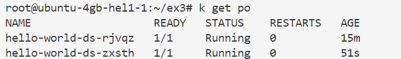
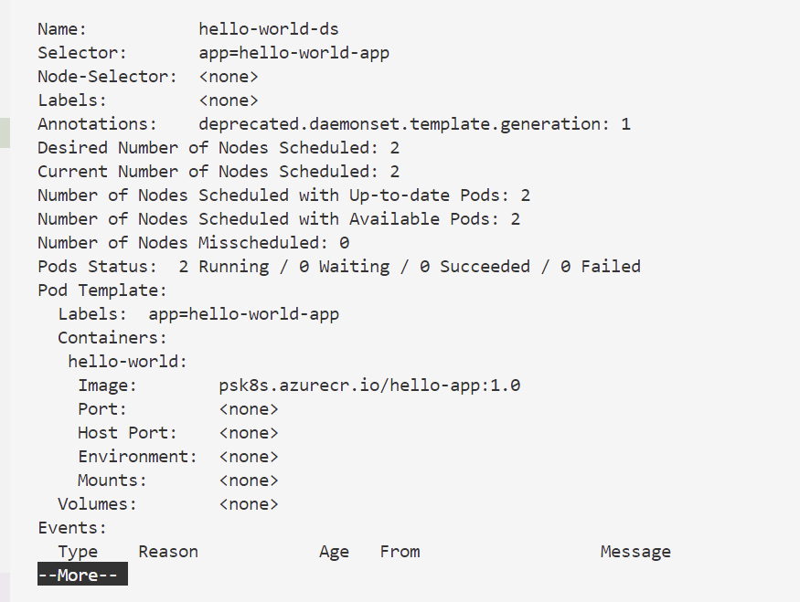
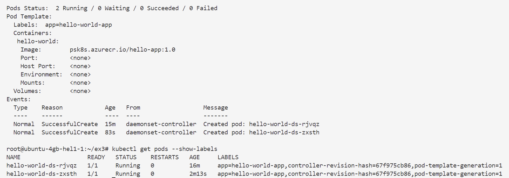
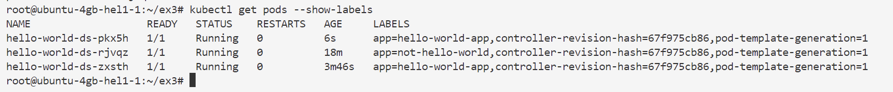
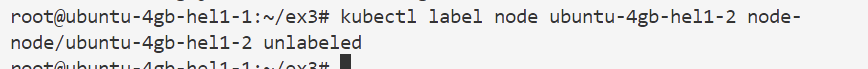
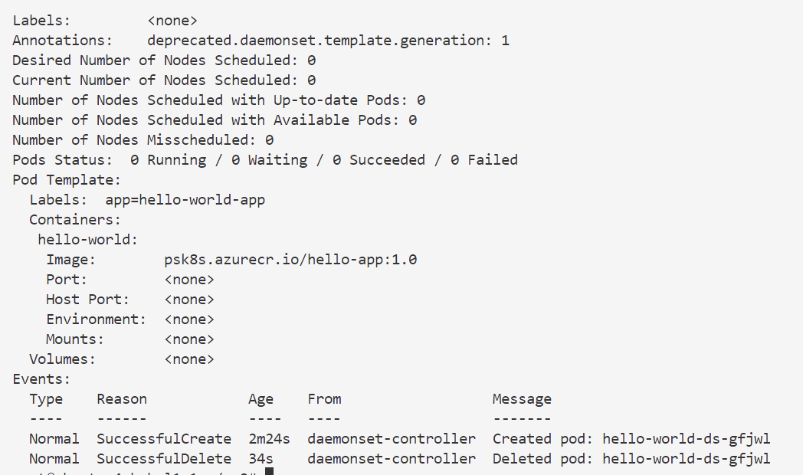

```markdown
# 🧪 Démonstration - Gestion des DaemonSets dans Kubernetes
⏱️ **Durée estimée : 25 minutes**

## 🎯 Objectifs
- Comprendre le fonctionnement des DaemonSets
- Déployer des pods sur tous les nœuds ou un sous-ensemble
- Modifier et mettre à jour des DaemonSets

## Introduction
Les DaemonSets permettent de déployer un pod sur chaque nœud (ou un sous-ensemble) d'un cluster Kubernetes. Cette démonstration couvre la création, la gestion et la mise à jour des DaemonSets.

---

## 🔧 Prérequis
- Un cluster Kubernetes avec plusieurs nœuds (au moins 1 nœud worker)
- kubectl configuré pour accéder au cluster

---

## 1️⃣ Création d'un DaemonSet sur tous les nœuds

### a) Vérifier les nœuds disponibles
```bash
kubectl get nodes
```
👉 Affiche la liste des nœuds du cluster avec leur statut.

### b) Voir un exemple de DaemonSet existant
```bash
kubectl get daemonsets --namespace kube-system kube-proxy
```
👉 Montre le DaemonSet `kube-proxy` qui s'exécute sur tous les nœuds.

### c) Créer un DaemonSet simple
```bash
kubectl apply -f DaemonSet.yaml
```
👉 Déploie un pod sur chaque nœud worker (pas sur le nœud de contrôle).

### d) Vérifier le DaemonSet
```bash
kubectl get daemonsets
kubectl get daemonsets -o wide
kubectl get pods -o wide
```

👉 Affiche :
- Le statut du DaemonSet
- Les pods créés sur chaque nœud
- L'emplacement des pods

### e) Examiner les détails du DaemonSet
```bash
kubectl describe daemonsets hello-world | more
```


👉 Affiche :
- Les labels utilisés
- Le nombre de nœuds desired/current
- Les événements
- Le template de pod

### f) Voir les labels des pods
```bash
kubectl get pods --show-labels
```

👉 Montre les labels automatiquement ajoutés par le contrôleur.

### g) Modifier un label de pod
```bash
# Récupérer le nom d'un pod
MYPOD=$(kubectl get pods -l app=hello-world-app | grep hello-world | head -n 1 | awk {'print $1'})
echo $MYPOD

# Modifier le label du pod
kubectl label pods $MYPOD app=not-hello-world --overwrite

# Vérifier la création d'un nouveau pod
kubectl get pods --show-labels
```

👉 Le contrôleur crée un nouveau pod pour maintenir le nombre de pods désiré.

### h) Nettoyer
```bash
kubectl delete daemonsets hello-world-ds
kubectl delete pods $MYPOD
```

---

## 2️⃣ Création d'un DaemonSet sur un sous-ensemble de nœuds

### a) Créer un DaemonSet avec nodeSelector
```bash
kubectl apply -f DaemonSetWithNodeSelector.yaml
```
👉 Aucune création de pod car aucun nœud ne possède le label requis.

### b) Ajouter un label à un nœud
```bash
kubectl label node c1-node1 node=hello-world-ns
```
👉 Ajoute un label au nœud c1-node1.

### c) Vérifier la création du pod
```bash
kubectl get daemonsets
kubectl get daemonsets -o wide
kubectl get pods -o wide
```
👉 Un pod est créé sur le nœud avec le label correspondant.

### d) Supprimer le label du nœud
```bash
kubectl label node c1-node1 node-
```

👉 Le pod est supprimé car le nœud ne correspond plus au sélecteur.

### e) Examiner le statut
```bash
kubectl describe daemonsets hello-world-ds
```

👉 Montre le statut et les événements.

### f) Nettoyer
```bash
kubectl delete daemonsets hello-world-ds
```

---

## 3️⃣ Mise à jour d'un DaemonSet

### a) Déployer la version initiale
```bash
kubectl apply -f DaemonSet.yaml
```
👉 Déploie la version 1.0 de l'application.

### b) Examiner la configuration
```bash
kubectl describe daemonsets hello-world
```
👉 Affiche la version actuelle de l'image (1.0).

### c) Voir la stratégie de mise à jour
```bash
kubectl get DaemonSet hello-world-ds -o yaml | more
```
👉 Montre la stratégie par défaut (rollingUpdate avec maxUnavailable=1).

### d) Mettre à jour l'image
```bash
# Comparer les versions
diff DaemonSet.yaml DaemonSet-v2.yaml

# Appliquer la mise à jour
kubectl apply -f DaemonSet-v2.yaml
```
👉 Met à jour l'image de 1.0 à 2.0.

### e) Suivre la progression
```bash
kubectl rollout status daemonsets hello-world-ds
```
👉 Affiche le statut de la mise à jour.

### f) Vérifier la mise à jour
```bash
kubectl describe daemonsets
kubectl get pods --show-labels
```
👉 Montre :
- La nouvelle version de l'image (2.0)
- Les nouveaux labels de révision
- Les événements de mise à jour

### g) Nettoyer
```bash
kubectl delete daemonsets hello-world-ds
```

---

## ✅ Résultats attendus
À la fin de cette démonstration, vous serez capable de :
1. Créer des DaemonSets pour déployer des pods sur tous les nœuds
2. Utiliser des sélecteurs pour cibler des sous-ensembles de nœuds
3. Mettre à jour des DaemonSets avec une stratégie de rolling update

## 💡 Bonnes pratiques
- Utilisez des DaemonSets pour les services qui doivent s'exécuter sur chaque nœud (moniteur, logs, etc.)
- Testez toujours les mises à jour dans un environnement de staging
- Surveillez les événements pendant les mises à jour
- Utilisez des labels clairs pour les nodeSelectors

## 📚 Pour aller plus loin
- Consultez la documentation officielle sur les DaemonSets
- Explorez les options de mise à jour (rollingUpdate vs OnDelete)
- Découvrez comment utiliser des taints et tolerations avec les DaemonSets
```