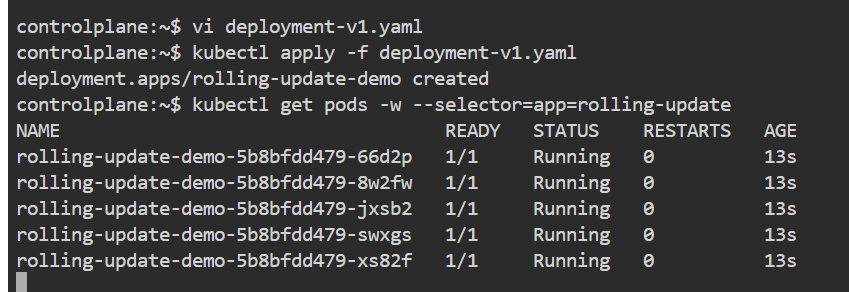
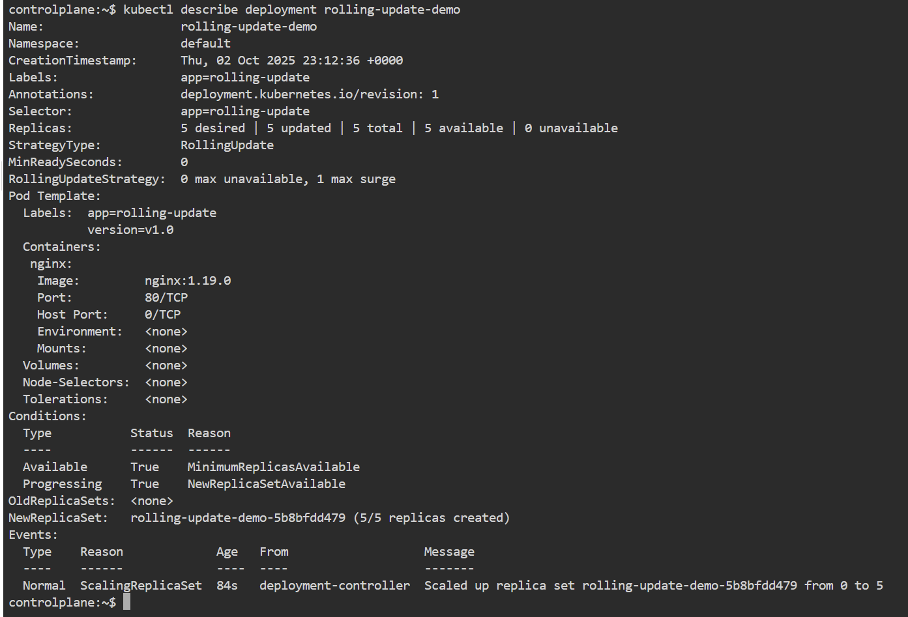
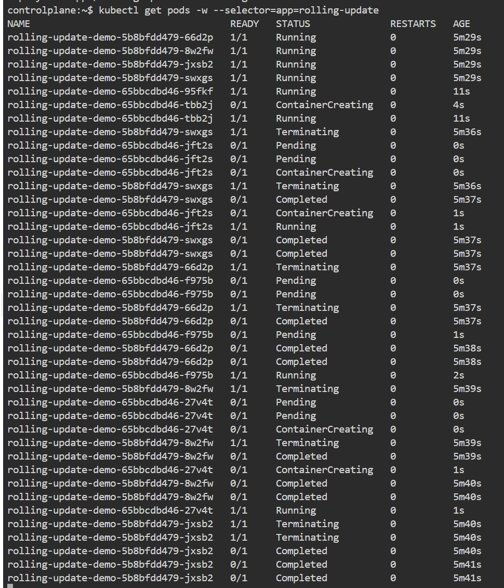
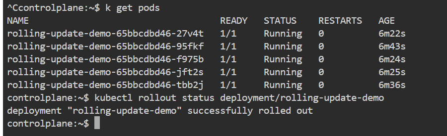

# 🧪 TP Kubernetes - Rolling Update en 20 minutes

## 🎯 Objectifs
- Comprendre le fonctionnement des Rolling Updates dans Kubernetes
- Mettre à jour une application sans interruption de service
- Observer le processus de mise à jour progressive
- Apprendre à contrôler le rythme des mises à jour

## 📋 Prérequis
- Un cluster Kubernetes fonctionnel
- kubectl configuré pour accéder au cluster
- Connaissances de base des Deployments

## 1️⃣ Créer un Deployment de base (2 min)

```yaml
# deployment-v1.yaml
apiVersion: apps/v1
kind: Deployment
metadata:
  name: rolling-update-demo
  labels:
    app: rolling-update
spec:
  replicas: 5
  selector:
    matchLabels:
      app: rolling-update
  strategy:
    type: RollingUpdate
    rollingUpdate:
      maxSurge: 1       # Nombre maximum de pods supplémentaires pendant la mise à jour
      maxUnavailable: 0 # Nombre maximum de pods indisponibles pendant la mise à jour
  template:
    metadata:
      labels:
        app: rolling-update
        version: v1.0   # Version initiale
    spec:
      containers:
      - name: nginx
        image: nginx:1.19.0  # Version initiale
        ports:
        - containerPort: 80
```

```bash
# Appliquer le deployment initial
kubectl apply -f deployment-v1.yaml

# Vérifier que les pods sont créés
kubectl get pods -w --selector=app=rolling-update
```


👉 **Explication** : Nous créons un deployment avec 5 réplicas utilisant nginx 1.19.0. La stratégie RollingUpdate est configurée pour ne jamais avoir de pods indisponibles (`maxUnavailable: 0`) et permettre un pod supplémentaire pendant la mise à jour (`maxSurge: 1`).

## 2️⃣ Vérifier le deployment initial (3 min)

```bash
# Vérifier les pods et leur version
kubectl get pods --show-labels

# Vérifier les détails du deployment
kubectl describe deployment rolling-update-demo

# Vérifier l'image utilisée
kubectl get deployment rolling-update-demo -o jsonpath='{.spec.template.spec.containers[0].image}'
```

👉 **Résultat attendu** : 5 pods en cours d'exécution avec l'image nginx:1.19.0 et le label version=v1.0

## 3️⃣ Mettre à jour le deployment (5 min)

```yaml
# deployment-v2.yaml
apiVersion: apps/v1
kind: Deployment
metadata:
  name: rolling-update-demo
  labels:
    app: rolling-update
spec:
  replicas: 5
  selector:
    matchLabels:
      app: rolling-update
  strategy:
    type: RollingUpdate
    rollingUpdate:
      maxSurge: 1
      maxUnavailable: 0
  template:
    metadata:
      labels:
        app: rolling-update
        version: v2.0   # Nouvelle version
    spec:
      containers:
      - name: nginx
        image: nginx:1.20.0  # Nouvelle version
        ports:
        - containerPort: 80
```

```bash
# Appliquer la mise à jour
kubectl apply -f deployment-v2.yaml

# Observer le processus de mise à jour en temps réel
kubectl get pods -w --selector=app=rolling-update
```

👉 **Explication** : Kubernetes met à jour progressivement les pods selon la stratégie configurée. Avec `maxUnavailable: 0` et `maxSurge: 1`, Kubernetes :
1. Crée un nouveau pod avec la version 1.20.0
2. Supprime un ancien pod (1.19.0) une fois que le nouveau est prêt
3. Répète jusqu'à ce que tous les pods soient mis à jour

## 4️⃣ Vérifier la progression de la mise à jour (5 min)

```bash
# Vérifier l'état du rolling update
kubectl rollout status deployment/rolling-update-demo

# Voir l'historique des revisions
kubectl rollout history deployment/rolling-update-demo

# Voir les détails d'une revision spécifique
kubectl rollout history deployment/rolling-update-demo --revision=1
kubectl rollout history deployment/rolling-update-demo --revision=2
```

👉 **Résultat attendu** : Vous verrez les pods être remplacés un par un, avec toujours 5 pods disponibles.

## 5️⃣ Contrôler manuellement le rolling update (5 min)

```bash
# Pause le rolling update
kubectl rollout pause deployment/rolling-update-demo

# Vérifier que la mise à jour est en pause
kubectl rollout status deployment/rolling-update-demo

# Reprendre la mise à jour
kubectl rollout resume deployment/rolling-update-demo

# Vérifier à nouveau la progression
kubectl rollout status deployment/rolling-update-demo
```

## 6️⃣ Annuler un rolling update (5 min)

```bash
# Simuler un problème en annulant la mise à jour
kubectl rollout undo deployment/rolling-update-demo

# Vérifier que les pods sont revenus à la version précédente
kubectl get pods -w --selector=app=rolling-update
```

👉 **Explication** : Cette commande annule la dernière mise à jour et revient à la version précédente du deployment.

## 7️⃣ Nettoyage (1 min)

```bash
# Supprimer le deployment
kubectl delete deployment rolling-update-demo
```

## ✅ Points de vérification
- [ ] Le deployment initial est créé avec 5 pods
- [ ] La mise à jour se fait progressivement sans interruption de service
- [ ] À tout moment, 5 pods sont disponibles
- [ ] L'historique des revisions est accessible
- [ ] Le rollback fonctionne correctement
