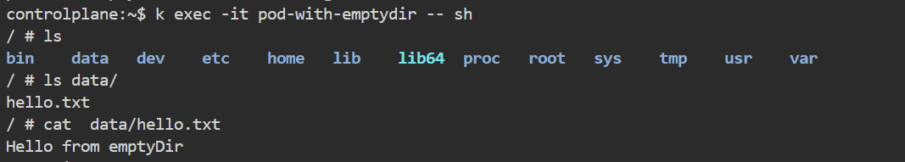
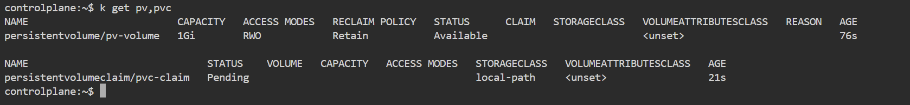
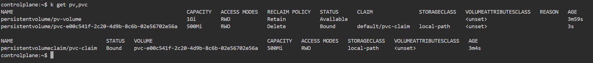
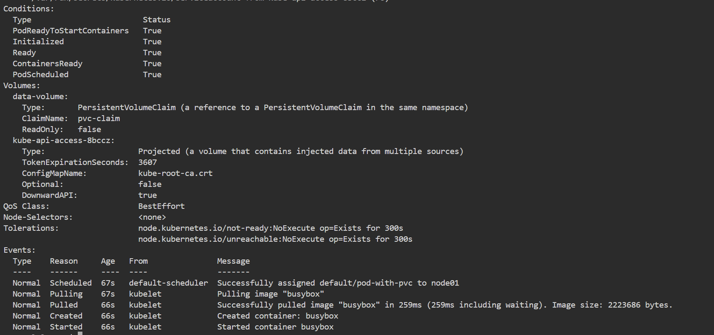
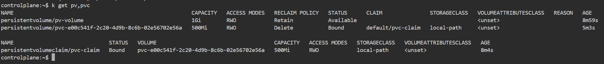

```markdown
# 🧪 Démonstration - Gestion du stockage dans Kubernetes
⏱️ **Durée estimée : 30 minutes**

## 🎯 Objectifs
- Comprendre les concepts de stockage dans Kubernetes
- Utiliser des volumes pour le stockage persistant
- Configurer des PersistentVolumes et des PersistentVolumeClaims
- Comprendre les classes de stockage (StorageClasses)

## Introduction
Kubernetes offre plusieurs options pour gérer le stockage des données dans un cluster. Cette démonstration couvre les concepts de base du stockage dans Kubernetes, y compris les volumes, les PersistentVolumes (PV), les PersistentVolumeClaims (PVC), et les StorageClasses.

---

## 1️⃣ Utilisation de volumes de base

### a) Créer un pod avec un volume de type emptyDir
```yaml
# pod-with-emptydir.yaml
# Définition d'un pod avec un volume éphémère de type emptyDir
apiVersion: v1
kind: Pod
metadata:
  name: pod-with-emptydir  # Nom du pod
spec:
  containers:
  - name: busybox  # Conteneur utilisant l'image busybox
    image: busybox
    # Commande qui écrit dans le volume et maintient le pod actif
    command: ["sh", "-c", "echo 'Hello from emptyDir' > /data/hello.txt && sleep 3600"]
    volumeMounts:
    - name: data-volume  # Nom du volume à monter
      mountPath: /data  # Chemin où le volume sera monté dans le conteneur
  volumes:
  - name: data-volume  # Déclaration du volume
    emptyDir: {}  # Type de volume éphémère
```
```bash
kubectl apply -f pod-with-emptydir.yaml  # Applique la configuration du pod
```
👉 **Explication** : Crée un pod avec un volume de type emptyDir, qui est un volume éphémère.
👉 **Résultat attendu** : Un pod est créé avec un volume temporaire qui existe tant que le pod est actif

### b) Vérifier le pod et le volume
```bash
kubectl get pods  # Liste les pods et leur statut
kubectl describe pod pod-with-emptydir  # Affiche les détails du pod y compris les volumes
```
👉 **Explication** : Vérifie que le pod est en cours d'exécution et affiche sa configuration

### Entrer dans le conteneur
```bash
kubectl exec -it pod-with-emptydir -- sh  # Ouvre un shell dans le conteneur
```
Dans le shell du conteneur :
```sh
cat /data/hello.txt  # Affiche le contenu du fichier créé dans le volume
```

👉 **Explication** : Vérifie que le volume est accessible et que le fichier a été créé

### c) Supprimer le pod
```bash
kubectl delete pod pod-with-emptydir  # Supprime le pod
```
👉 **Explication** : Supprime le pod pour nettoyer les ressources. Le volume emptyDir est détruit avec le pod

---

## 2️⃣ Utilisation de PersistentVolumes et PersistentVolumeClaims

### a) Créer un PersistentVolume (PV)
```yaml
# pv.yaml
# Définition d'un PersistentVolume (ressource de stockage dans le cluster)
apiVersion: v1
kind: PersistentVolume
metadata:
  name: pv-volume  # Nom du PV
spec:
  capacity:
    storage: 1Gi  # Capacité de stockage
  accessModes:
    - ReadWriteOnce  # Mode d'accès (un seul nœud en lecture/écriture)
  persistentVolumeReclaimPolicy: Retain  # Politique de conservation
  hostPath:
    path: /mnt/data  # Chemin sur le nœud hôte
```
```bash
kubectl apply -f pv.yaml  # Crée le PersistentVolume
```
👉 **Explication** : Crée un PersistentVolume pour le stockage persistant.
👉 **Résultat attendu** : Un PV est créé avec une capacité de 1Gi et une politique de conservation

### b) Créer un PersistentVolumeClaim (PVC)
```yaml
# pvc.yaml
# Définition d'une demande de stockage (PersistentVolumeClaim)
apiVersion: v1
kind: PersistentVolumeClaim
metadata:
  name: pvc-claim  # Nom du PVC
spec:
  accessModes:
    - ReadWriteOnce  # Doit correspondre au mode d'accès du PV
  resources:
    requests:
      storage: 500Mi  # Quantité de stockage demandée
```
```bash
kubectl apply -f pvc.yaml  # Crée le PersistentVolumeClaim
```
👉 **Explication** : Crée un PersistentVolumeClaim pour demander du stockage.
👉 **Résultat attendu** : Le PVC est lié au PV si les critères correspondent

### c) Vérifier le PV et le PVC
```bash
kubectl get pv  # Liste les PersistentVolumes
kubectl get pvc  # Liste les PersistentVolumeClaims
```

👉 **Explication** : Vérifie que le PV et le PVC sont créés et liés

### d) Créer un pod qui utilise le PVC
```yaml
# pod-with-pvc.yaml
# Définition d'un pod utilisant un PVC pour le stockage
apiVersion: v1
kind: Pod
metadata:
  name: pod-with-pvc  # Nom du pod
spec:
  containers:
  - name: busybox
    image: busybox
    # Commande qui écrit dans le volume persistant
    command: ["sh", "-c", "echo 'Hello from PVC' > /data/hello.txt && sleep 3600"]
    volumeMounts:
    - name: data-volume
      mountPath: /data
  volumes:
  - name: data-volume
    persistentVolumeClaim:
      claimName: pvc-claim  # Utilise le PVC créé précédemment
```
```bash
kubectl apply -f pod-with-pvc.yaml  # Crée le pod
kubectl get pv,pvc  # Vérifie le statut des PV et PVC
```

👉 **Explication** : Crée un pod qui utilise le PersistentVolumeClaim pour le stockage

### e) Vérifier le pod et le volume
```bash
kubectl get pods  # Vérifie que le pod est en cours d'exécution
kubectl describe pod pod-with-pvc  # Affiche les détails du pod
```

👉 **Explication** : Vérifie que le pod est créé et utilise correctement le volume persistant

### f) Nettoyage des ressources
```bash
kubectl delete pod pod-with-pvc  # Supprime le pod mais conserve le PVC et PV
kubectl get pv,pvc  # Vérifie l'état des ressources
```

```bash
kubectl delete pvc pvc-claim  # Supprime le PVC
kubectl delete pv pv-volume  # Supprime le PV
```
👉 **Explication** : Nettoie les ressources. Le PV est supprimé mais les données peuvent être conservées selon la politique de réclamation

```
