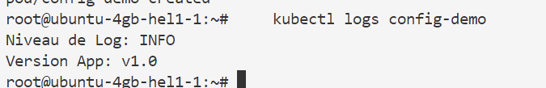
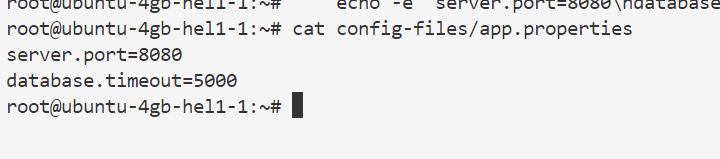
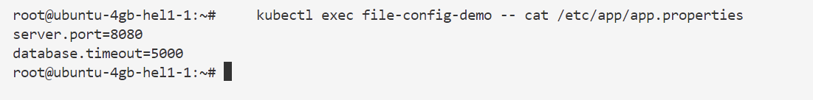
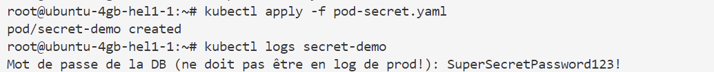
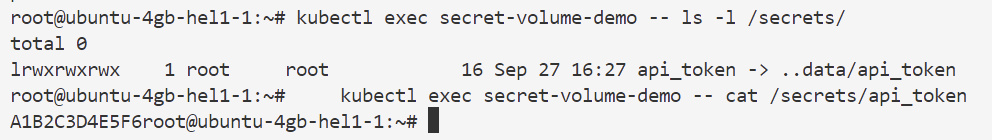

Ces exercices couvrent l'utilisation des **ConfigMaps et des Secrets**, ainsi que les bonnes pratiques.

-----

## 1\. ConfigMap : Configuration via Variable d'Environnement (5-10 min) ⚙️

Cet exercice vise à créer une **ConfigMap** pour des données de configuration non sensibles et à l'injecter dans un Pod en tant que **variable d'environnement**.

### Objectifs

1.  Créer une ConfigMap en utilisant l'approche impérative (`kubectl create configmap`).
2.  Déployer un Pod qui utilise une clé de cette ConfigMap pour définir une variable d'environnement.
3.  Vérifier que la variable est correctement injectée dans le Pod.

### Étapes

1.  **Création de la ConfigMap :**
    Créez une ConfigMap nommée `app-config` avec la clé `LOG_LEVEL` ayant la valeur `INFO` et la clé `APP_VERSION` avec la valeur `v1.0`.
    ```bash
    kubectl create configmap app-config --from-literal=LOG_LEVEL=INFO --from-literal=APP_VERSION=v1.0
    ```
2.  **Déploiement du Pod :**
    Créez un fichier YAML pour un Pod (`pod-configmap.yaml`) qui utilise l'image `busybox` et injecte les deux clés de la ConfigMap comme variables d'environnement.
    ```yaml
    # pod-configmap.yaml
    apiVersion: v1
    kind: Pod
    metadata:
      name: config-demo
    spec:
      containers:
      - name: demo-container
        image: busybox
        command: ['sh', '-c', 'echo "Niveau de Log: $LOG_LEVEL" && echo "Version App: $APP_VERSION" && sleep 3600']
        env:
        - name: LOG_LEVEL
          valueFrom:
            configMapKeyRef:
              name: app-config
              key: LOG_LEVEL
        - name: APP_VERSION
          valueFrom:
            configMapKeyRef:
              name: app-config
              key: APP_VERSION
      restartPolicy: Never
    ```
    Appliquez le manifeste : `kubectl apply -f pod-configmap.yaml`
3.  **Vérification :**
    Affichez les logs du Pod pour confirmer que les variables d'environnement ont été lues :
    ```bash
    kubectl logs config-demo
    
    ```
    *Attendez-vous à voir les messages affichant `INFO` et `v1.0`.*

-----

## 2\. ConfigMap : Configuration via Fichiers Montés (5-10 min) 📁

Cet exercice se concentre sur l'injection de la ConfigMap en tant que **volume monté**, simulant l'utilisation de fichiers de configuration par une application.

### Objectifs

1.  Créer une ConfigMap pour stocker un fichier de configuration complet.
2.  Monter cette ConfigMap comme un volume dans un Pod.
3.  Vérifier le contenu du fichier monté à l'intérieur du Pod.

### Étapes

1.  **Création du Fichier de Configuration Local :**
    Créez un dossier et un fichier local qui simulent le fichier de configuration de votre application.
    ```bash
    mkdir config-files
    echo -e "server.port=8080\ndatabase.timeout=5000" > config-files/app.properties
    
    ```
2.  **Création de la ConfigMap à partir du Fichier :**
    Créez une ConfigMap nommée `file-config` à partir du fichier local. Le nom du fichier (`app.properties`) deviendra la clé.
    ```bash
    kubectl create configmap file-config --from-file=config-files/app.properties
    ```
3.  **Déploiement du Pod avec Volume Monté :**
    Créez un fichier YAML pour un Pod (`pod-configmap-volume.yaml`) qui monte la ConfigMap `file-config` dans le chemin `/etc/app/`.
    ```yaml
    # pod-configmap-volume.yaml
    apiVersion: v1
    kind: Pod
    metadata:
      name: file-config-demo
    spec:
      containers:
      - name: demo-container
        image: busybox
        command: ['sleep', '3600']
        volumeMounts:
        - name: config-volume
          mountPath: /etc/app
          readOnly: true
      volumes:
      - name: config-volume
        configMap:
          name: file-config
      restartPolicy: Never
    ```
    Appliquez le manifeste : `kubectl apply -f pod-configmap-volume.yaml`
4.  **Vérification :**
    Exécutez une commande dans le Pod pour afficher le contenu du fichier monté :
    ```bash
    kubectl exec file-config-demo -- cat /etc/app/app.properties
    
    ```
    *Attendez-vous à voir le contenu de `app.properties`.*

-----

## 3\. Secrets : Création et Injection de Données Sensibles (5-10 min) 🔑

Cet exercice illustre l'utilisation des **Secrets** pour stocker des données sensibles (un mot de passe) et les injecter dans un Pod via une **variable d'environnement**.

### Objectifs

1.  Créer un Secret générique à partir de valeurs littérales (mot de passe).
2.  Déployer un Pod qui utilise ce Secret pour définir une variable d'environnement.
3.  Vérifier que la donnée sensible est accessible (mais jamais visible en clair dans le YAML ou la ConfigMap).

### Étapes

1.  **Création du Secret :**
    Créez un Secret générique nommé `db-credentials` avec une clé `db_password` et une valeur que vous choisissez.
    ```bash
    kubectl create secret generic db-credentials --from-literal=db_password="SuperSecretPassword123!"
    ```
    *Note : Kubernetes base64-encode automatiquement la valeur.*
2.  **Déploiement du Pod :**
    Créez un fichier YAML pour un Pod (`pod-secret.yaml`) qui utilise l'image `busybox` et injecte la clé `db_password` du Secret en tant que variable d'environnement `DB_PASS`.
    ```yaml
    # pod-secret.yaml
    apiVersion: v1
    kind: Pod
    metadata:
      name: secret-demo
    spec:
      containers:
      - name: app-container
        image: busybox
        command: ['sh', '-c', 'echo "Mot de passe de la DB (ne doit pas être en log de prod!): $DB_PASS" && sleep 3600']
        env:
        - name: DB_PASS
          valueFrom:
            secretKeyRef:
              name: db-credentials
              key: db_password
      restartPolicy: Never
    ```
    Appliquez le manifeste : `kubectl apply -f pod-secret.yaml`
3.  **Vérification :**
    Affichez les logs du Pod pour confirmer que la valeur du Secret est passée :
    ```bash
    kubectl logs secret-demo
    
    ```
    *Attendez-vous à voir le mot de passe s'afficher (dans ce contexte de lab uniquement pour vérification).*

-----

## 4\. Secret : Bonnes Pratiques avec Volume Monté (5-10 min) 🔐

Cet exercice met en œuvre une **bonne pratique de sécurité** : l'injection du Secret en tant que **fichier monté** plutôt que comme variable d'environnement, car les variables d'environnement des Secrets sont visibles via `kubectl exec <pod> -- env`.

### Objectifs

1.  Créer un nouveau Secret.
2.  Monter ce Secret comme un volume dans un Pod, avec un chemin de montage spécifique.
3.  Vérifier que le Secret est accessible en tant que fichier dans le Pod.
4.  Comprendre la nécessité d'utiliser des **volumes montés** pour les Secrets dans un environnement de production.

### Étapes

1.  **Création du Secret :**
    Créez un Secret nommé `api-token-secret` contenant la clé `api_token` et la valeur `A1B2C3D4E5F6`.
    ```bash
    kubectl create secret generic api-token-secret --from-literal=api_token=A1B2C3D4E5F6
    ```
2.  **Déploiement du Pod avec Volume Monté :**
    Créez un fichier YAML pour un Pod (`pod-secret-volume.yaml`) qui monte le Secret `api-token-secret` dans le chemin `/secrets/`. Chaque clé du Secret devient un fichier dont le nom est la clé.
    ```yaml
    # pod-secret-volume.yaml
    apiVersion: v1
    kind: Pod
    metadata:
      name: secret-volume-demo
    spec:
      containers:
      - name: app-container
        image: busybox
        command: ['sleep', '3600']
        volumeMounts:
        - name: token-volume
          mountPath: /secrets/
          readOnly: true  # Bonne pratique : montage en lecture seule
      volumes:
      - name: token-volume
        secret:
          secretName: api-token-secret
      restartPolicy: Never
    ```
    Appliquez le manifeste : `kubectl apply -f pod-secret-volume.yaml`
3.  **Vérification :**
    Exécutez une commande dans le Pod pour lister les fichiers et afficher le contenu du Secret monté :
    ```bash
    kubectl exec secret-volume-demo -- ls -l /secrets/
    kubectl exec secret-volume-demo -- cat /secrets/api_token
    
    ```
    *Attendez-vous à voir un fichier nommé `api_token` et son contenu (la valeur du token) en affichage.*

### Nettoyage (optionnel)

Pour nettoyer les ressources après les exercices :

```bash
kubectl delete pod config-demo file-config-demo secret-demo secret-volume-demo
kubectl delete configmap app-config file-config
kubectl delete secret db-credentials api-token-secret
rm -rf config-files
```