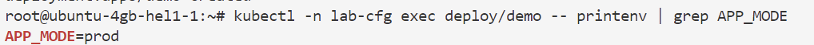
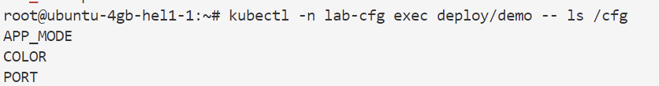

## 🔹 Exercice 1 — ConfigMap : Variables d’environnement & Fichiers

**Objectif** : Apprendre à créer, monter et vérifier un ConfigMap.

1. **Préparer l’espace de travail**

```bash
kubectl create ns lab-cfg
```

Namespace dédié pour isoler les tests.

2. **Créer un ConfigMap**

```bash
kubectl -n lab-cfg create configmap app-cfg \
  --from-literal=APP_MODE=prod \
  --from-literal=PORT=8080 \
  --from-literal=COLOR=blue
```

> Ajoutons plusieurs clés pour simuler une vraie configuration.

3. **Déployer une application qui l’utilise**
   Créer un `Deployment` deploy-configmap.yaml :

```yaml
apiVersion: apps/v1
kind: Deployment
metadata:
  name: demo
  namespace: lab-cfg
spec:
  replicas: 1
  selector: { matchLabels: { app: demo } }
  template:
    metadata: { labels: { app: demo } }
    spec:
      containers:
      - name: web
        image: busybox
        command: ["sh", "-c", "sleep 3600"]
        envFrom:
        - configMapRef: { name: app-cfg }
        volumeMounts:
        - name: cfg
          mountPath: /cfg
      volumes:
      - name: cfg
        configMap: { name: app-cfg }
```
Appliquez le manifeste : `kubectl apply -f deploy-configmap.yaml`
4. **Vérifier l’injection**

```bash
kubectl -n lab-cfg exec deploy/demo -- printenv | grep APP_MODE


kubectl -n lab-cfg exec deploy/demo -- ls /cfg

```

👉 **Durée estimée : 30 min (création + tests + modifs)**

---

## 🔹 Exercice 2 — Bonnes pratiques ConfigMap

**Objectif** : Découvrir les options avancées.

1. **Créer un ConfigMap immuable**

```bash
kubectl -n lab-cfg create configmap app-cfg-imm --from-literal=FEATURE_X=true 
```

2. **Monter uniquement une clé spécifique**

```yaml
env:
- name: CFG_FEATURE_X
  valueFrom:
    configMapKeyRef:
      name: app-cfg-imm
      key: FEATURE_X
```

3. **Créer un second Pod de test** pour vérifier le comportement.

4. **Tester la mise à jour**

* Essayer un `kubectl edit configmap app-cfg-imm` ➝ erreur car immuable.
* Supprimer et recréer pour changer les valeurs.

5. **Bonnes pratiques à appliquer** :

* Nommer les clés en majuscules.
* Préfixer pour éviter collisions (`APP_`, `DB_`, …).
* Toujours versionner les fichiers de ConfigMap dans Git.

👉 **Durée estimée : 30 min (expérimentations + bonnes pratiques)**

---

## 🔹 Exercice 3 — Secrets (variables & fichiers)

**Objectif** : Gérer des données sensibles.

1. **Créer un Secret**

```bash
kubectl -n lab-cfg create secret generic db-secret \
  --from-literal=USER=app \
  --from-literal=PASSWORD='S3cReT!'
```

2. **Déployer une app qui consomme le Secret**

* Injection en `envFrom.secretRef`.
* Montée en volume `/secrets`.

3. **Vérifier dans le Pod**

```bash
kubectl -n lab-cfg exec deploy/demo -- printenv | grep USER
kubectl -n lab-cfg exec deploy/demo -- ls /secrets
```

4. **Décoder le secret depuis etcd**

```bash
kubectl -n lab-cfg get secret db-secret -o yaml
echo "<valeur_base64>" | base64 -d
```

⚠️ Montre que Kubernetes ne chiffre pas nativement.

5. **Sécuriser le Pod**

* Ajouter `readOnly: true` sur le volume.
* Ajouter `securityContext.fsGroup: 2000` pour que seul le Pod accède aux fichiers.

👉 **Durée estimée : 30 min (création + lecture + sécurité)**

---

## 🔹 Exercice 4 — Sécurité et rotation des Secrets

**Objectif** : RBAC minimal + rotation de mot de passe.

1. **Créer un Role** qui autorise uniquement l’accès à `db-secret` :

```yaml
kind: Role
apiVersion: rbac.authorization.k8s.io/v1
metadata:
  namespace: lab-cfg
  name: db-secret-reader
rules:
- apiGroups: [""]
  resources: ["secrets"]
  resourceNames: ["db-secret"]
  verbs: ["get"]
```

2. **Créer un ServiceAccount dédié** pour le Pod.

```bash
kubectl -n lab-cfg create sa db-app
```

3. **Lier le Role** au ServiceAccount.

```bash
kubectl -n lab-cfg create rolebinding db-secret-binding \
  --role=db-secret-reader --serviceaccount=lab-cfg:db-app
```

4. **Redéployer le Pod** avec ce ServiceAccount.

5. **Tester la rotation**

```bash
kubectl -n lab-cfg create secret generic db-secret \
  --from-literal=USER=app \
  --from-literal=PASSWORD='N3w!' \
  -o yaml --dry-run=client | kubectl apply -f -
kubectl -n lab-cfg rollout restart deploy/demo
```

6. **Bonnes pratiques**

* Chiffrement des Secrets au repos (`EncryptionConfiguration`).
* Ne jamais stocker les Secrets en clair dans Git.
* Utiliser un gestionnaire externe (HashiCorp Vault, Azure Key Vault, …).

👉 **Durée estimée : 30 min (RBAC + ServiceAccount + rotation)**

---

⚡ Résumé :

* Ex1 : ConfigMap simple → env + volume.
* Ex2 : Bonnes pratiques ConfigMap (immuable, clés ciblées).
* Ex3 : Secrets → env, volume, sécurité.
* Ex4 : Sécurité avancée → RBAC, rotation.

