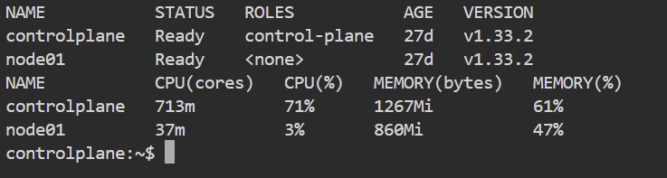
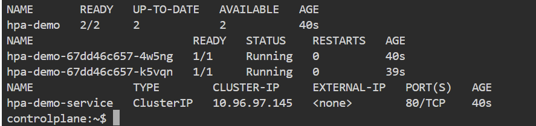
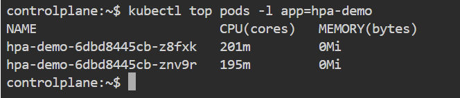
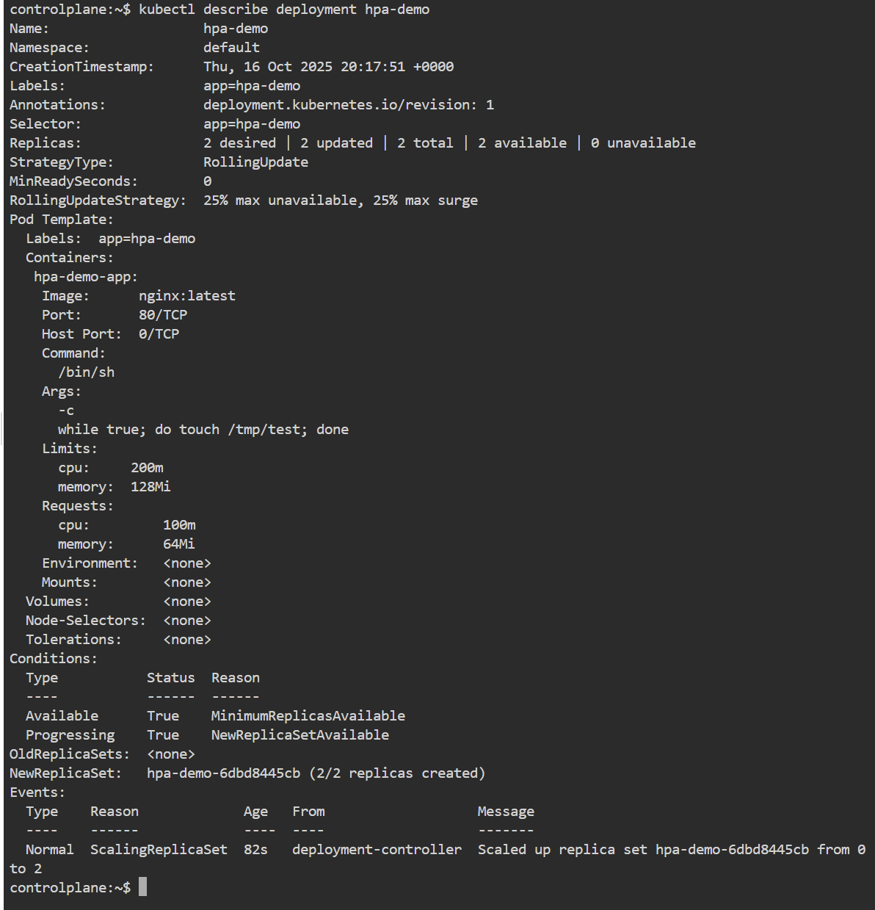
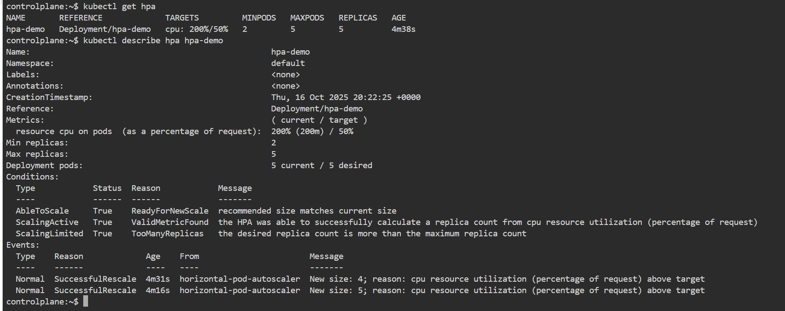
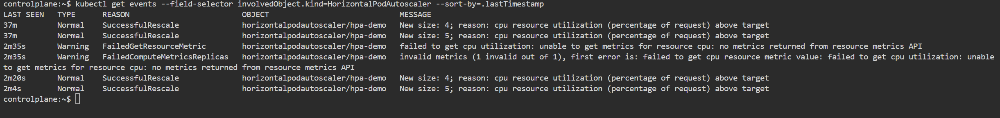

# 🔧 Lab Complet : Horizontal Pod Autoscaler (HPA) avec Kubernetes

## 🎯 Objectif du Lab
Comprendre et configurer l'auto-scaling horizontal basé sur l'utilisation CPU dans Kubernetes.

## 📚 Concepts Clés

### Qu'est-ce que le HPA ?
Le **Horizontal Pod Autoscaler** ajuste automatiquement le nombre de pods dans un déploiement en fonction de l'utilisation des ressources.

### Comment ça marche ?
1. **Metrics Server** collecte les métriques de ressources
2. **HPA** surveille ces métriques
3. **Scaling** se déclenche quand les seuils sont dépassés
4. **Controller Manager** ajuste les replicas

---

## 🚀 Phase 1 : Configuration Initiale

### 1.1 Vérification de l'environnement
```bash
# Vérifier que Kubernetes fonctionne
kubectl cluster-info

# Vérifier les nodes
kubectl get nodes

# Vérifier que Metrics Server est installé (CRUCIAL)
kubectl top nodes
```


**💡 Commentaire :** Si `kubectl top nodes` ne fonctionne pas, il faut installer Metrics Server.

### 1.2 Création du fichier de déploiement
```bash
# Créer le fichier hpa-demo.yaml
kubectl apply -f - <<EOF
apiVersion: apps/v1
kind: Deployment
metadata:
  name: hpa-demo
spec:
  replicas: 2
  selector:
    matchLabels:
      app: hpa-demo
  template:
    metadata:
      labels:
        app: hpa-demo
    spec:
      containers:
      - name: nginx
        image: nginx:latest
        ports:
        - containerPort: 80
        resources:
          requests:
            cpu: 100m
            memory: 64Mi
          limits:
            cpu: 200m
            memory: 128Mi
---
apiVersion: v1
kind: Service
metadata:
  name: hpa-demo-service
spec:
  selector:
    app: hpa-demo
  ports:
  - port: 80
    targetPort: 80
EOF
```

**📝 Explications :**
- **`resources.requests`** : Ressources réservées pour le pod
- **`resources.limits`** : Limites maximum pour le pod
- **`cpu: 100m`** = 0.1 core CPU
- La commande dans le container génère une charge CPU constante

---

## 🛠 Phase 2 : Déploiement de l'Application

### 2.1 Déploiement de l'application
```bash
# Vérifier le déploiement
kubectl get deployment hpa-demo

# Vérifier les pods
kubectl get pods -l app=hpa-demo

# Vérifier le service
kubectl get service hpa-demo-service
```


### 2.2 Vérification des ressources
```bash
# Voir l'utilisation des ressources des pods
kubectl top pods -l app=hpa-demo

# Détails du déploiement
kubectl describe deployment hpa-demo
```
**🔍 Observation attendue :**




---

## ⚡ Phase 3 : Configuration du HPA

### 3.1 Création du Horizontal Pod Autoscaler
```bash
# Créer le HPA avec des paramètres spécifiques
kubectl autoscale deployment hpa-demo \
  --cpu-percent=50 \    # 🔹 Seuil de déclenchement à 50% CPU
  --min=2 \             # 🔹 Minimum de 2 pods
  --max=5 \             # 🔹 Maximum de 5 pods
  --name=hpa-demo       # 🔹 Nom du HPA
```

**🎯 Paramètres du HPA :**
- **`--cpu-percent=50`** : Scaling déclenché à 50% d'utilisation CPU
- **`--min=2`** : Toujours au moins 2 pods actifs
- **`--max=5`** : Maximum 5 pods même sous forte charge

### 3.2 Vérification du HPA
```bash
# Voir le HPA créé
kubectl get hpa hpa-demo

# Détails complets du HPA
kubectl describe hpa hpa-demo
```

**🔍 Résultat attendu :**


**📊 Lecture des colonnes :**
- **TARGETS** : `0%/50%` = utilisation actuelle / seuil de scaling
- **MINPODS/MAXPODS** : limites configurées
- **REPLICAS** : nombre actuel de pods

---

## 🧪 Phase 4 : Test de Charge et Scaling

### 4.1 Préparation de l'observation
```bash
# Terminal 1 - Surveiller le HPA en temps réel
watch -n 2 "kubectl get hpa hpa-demo && echo '---' && kubectl top pods -l app=hpa-demo"

# Terminal 2 - Surveiller les pods
watch -n 2 "kubectl get pods -l app=hpa-demo | grep -v Terminating"
```

### 4.2 Génération de charge CPU
** Scale manuel pour tester**
```bash
# Modifier le déploiement pour augmenter la charge CPU
kubectl patch deployment hpa-demo -p '{"spec":{"template":{"spec":{"containers":[{"name":"nginx","command":["/bin/sh"],"args":["-c","while true; do sha256sum /dev/zero | head -c 1000000 > /dev/null; done"]}]}}}}'
```

### 4.3 Observation du scaling
**📈 Comportement attendu :**

1. **Phase initiale** : 2 pods à 0-10% CPU
2. **Sous charge** : CPU dépasse 50% → scaling déclenché
3. **Scaling up** : Augmentation progressive des replicas
4. **Stabilisation** : HPA trouve l'équilibre autour de 50% CPU

**🔍 Commande de monitoring avancée :**
```bash
# Voir les événements de scaling
kubectl get events --field-selector involvedObject.kind=HorizontalPodAutoscaler --sort-by=.lastTimestamp
```

---

## 📊 Phase 5 : Analyse des Résultats

### 5.1 État final du HPA
```bash
# État du HPA après test
kubectl get hpa hpa-demo

# Historique des replicas
kubectl describe hpa hpa-demo | grep -A 10 "Events"
```

### 5.2 Métriques détaillées
```bash
# Utilisation détaillée des ressources
kubectl top pods -l app=hpa-demo --use-protocol-buffers

# Détails des décisions de scaling
kubectl describe hpa hpa-demo
```

---

## 🧹 Phase 6 : Nettoyage

### 6.1 Suppression des ressources
```bash
# Supprimer le HPA
kubectl delete hpa hpa-demo

# Supprimer le déploiement et service
kubectl delete -f hpa-demo.yaml

# Supprimer le générateur de charge (si encore actif)
kubectl delete pod load-generator --ignore-not-found=true

# Vérifier que tout est nettoyé
kubectl get all -l app=hpa-demo
```

---

## 🔧 Prérequis et Dépannage

### Installation de l'outil `hey` pour les tests de charge
```bash
# macOS
brew install hey

# Linux (Ubuntu/Debian)
sudo apt-get update && sudo apt-get install -y hey

# Windows (avec Chocolatey)
choco install hey
```

### Test avec `hey`
```bash
# Obtenir l'IP du service
SERVICE_IP=$(kubectl get service hpa-demo-service -o jsonpath='{.spec.clusterIP}')

# Générer de la charge pendant 5 minutes
hey -z 300s -c 10 http://${SERVICE_IP}
```

---

## 📝 Journal de Lab Typique

```
⏱️  T+0s     : Déploiement initial - 2 pods
⏱️  T+30s    : HPA créé - cible 50% CPU
⏱️  T+1m     : Début charge - CPU à 15%
⏱️  T+2m     : CPU à 65% - scaling déclenché
⏱️  T+3m     : 3 pods - CPU à 45%
⏱️  T+4m     : CPU à 70% - scaling à 4 pods
⏱️  T+5m     : Stabilisation - 4 pods à 52% CPU
⏱️  T+10m    : Arrêt charge - scaling down progressif
```

---

## 🎓 Points Clés à Retenir

1. **HPA nécessite Metrics Server** pour fonctionner
2. **Les resources requests/limits doivent être définies**
3. **Le scaling n'est pas instantané** (délai de 15-30s)
4. **Le HPA utilise la moyenne d'utilisation** sur tous les pods
5. **Le period** évite le scaling trop agressif

Ce lab complet vous permet de maîtriser l'autoscaling horizontal dans Kubernetes ! 🚀